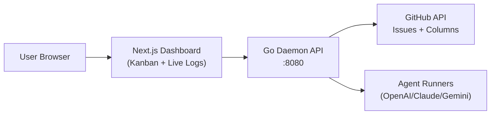
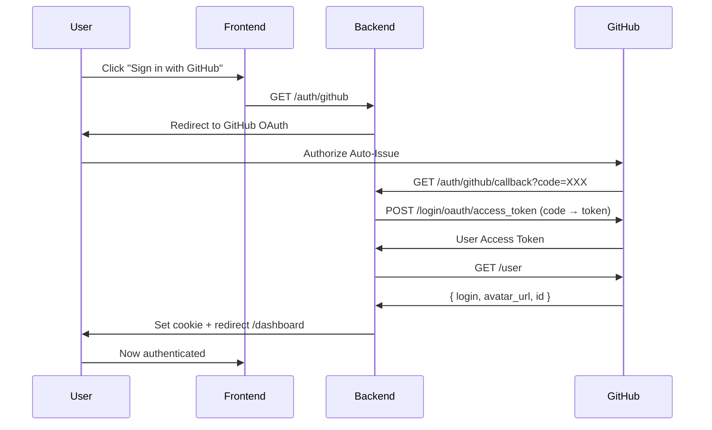

# Auto-Issue Frontend — Implementation Guide

> Next.js 15 App Router dashboard for autonomous issue resolution
> **Stack:** TypeScript · Next.js 15 · Tailwind CSS · SSE (Server-Sent Events) · GitHub OAuth

---

## Architecture Overview

The frontend is a **web dashboard** (Next.js app) that communicates with the Go backend daemon via REST API + SSE for real-time updates.



**Key features:**
- Real-time Kanban board showing run statuses
- Live terminal-style log viewer via SSE
- OAuth login with GitHub
- Configuration editor for WORKFLOW.md
- Approval/rejection UI for human gates

---

## Directory Structure

```
frontend/
├── app/
│   ├── page.tsx                 # Kanban board (protected, default layout)
│   ├── runs/[id]/page.tsx       # Run detail + terminal log viewer
│   ├── config/page.tsx          # WORKFLOW.md visual editor
│   ├── login/page.tsx           # OAuth login page
│   ├── layout.tsx               # Root layout (auth middleware)
│   └── (landing)/
│       └── page.tsx             # Landing page (public)
│
├── components/
│   ├── KanbanBoard.tsx          # Main board with status columns
│   ├── RunCard.tsx              # Card showing run status + metadata
│   ├── AgentTerminal.tsx        # Terminal-style log viewer
│   ├── ApprovePanel.tsx         # Approve/reject UI for human gates
│   ├── ProviderBadge.tsx        # Colored badge (openai/anthropic/gemini)
│   ├── QAStatus.tsx             # Test result display
│   ├── UserMenu.tsx             # Avatar + Sign out dropdown
│   ├── Sidebar.tsx              # Navigation menu
│   └── Header.tsx               # App header
│
├── lib/
│   ├── api.ts                   # Fetch helpers + client setup
│   ├── sse.ts                   # useSSE hook for real-time logs
│   ├── types.ts                 # TypeScript interfaces (shared with backend)
│   └── utils.ts                 # Helpers (formatters, validators)
│
├── middleware.ts                # Auth middleware (protects routes)
├── package.json
├── tsconfig.json
├── next.config.ts
├── tailwind.config.ts
└── .env.local                   # GitHub Client ID (public, safe)
```

---

## Key Pages

### `app/page.tsx` — Kanban Board (Protected)

Main dashboard showing all runs.

**Layout:**
- Left sidebar: Navigation (Dashboard, Config, Settings)
- Main area: Kanban board with 4 columns
  - `Queued` — issues waiting to run
  - `Running` — agents currently working (show agent count: "3/12 agents")
  - `Awaiting Approval` — human needs to decide
  - `Done / Failed` — completed or error

**Real-time updates:**
- Poll `/api/runs` every 5s for list changes
- SSE stream for log updates in focused run

**Interactions:**
- Click RunCard → navigate to `/runs/:id`
- Hover over card → show provider badge, timing, retry count

### `app/runs/[id]/page.tsx` — Run Detail + Terminal

Full view of a single run execution.

**Layout:**
- Header: issue title, issue #, status badge, timestamps
- Left panel (40%):
  - Issue description
  - Run metadata: provider, model, started_at, turns count
  - Approval/rejection panel (if status = awaiting_approval)
- Right panel (60%):
  - AgentTerminal component (SSE log viewer)
  - Test result badge (if available)
  - PR link button (if status = pr_opened)

**SSE events displayed:**
```
[12:34:05] Creating worktree...
[12:34:10] Agent started (turn 1)
> I'll read the issue description first...
[12:34:15] Modified: src/components/Header.tsx
> Now I'll write tests...
[12:34:25] ✓ Tests passed: 12/12
[12:35:00] Solution ready for review
```

### `app/config/page.tsx` — WORKFLOW.md Editor

Visual editor for the workflow configuration (no raw YAML editing).

**Form fields:**
- Polling interval (seconds)
- Max concurrent agents (1-12)
- Trigger columns (checkboxes)
- Agent: type, model, max iterations, timeout
- Test runner: enabled/disabled
- Memory: enabled/disabled

**Behavior:**
- Read current WORKFLOW.md via `GET /api/config`
- User edits form
- Save via `PUT /api/config` (backend writes to file)
- Show toast: "Configuration saved"

### `app/login/page.tsx` — OAuth Login

Minimal login page.

**Design:**
- Centered logo + app name
- "Sign in with GitHub" button
- No email/password fields

**Flow:**
1. User clicks button → `GET /auth/github`
2. Backend redirects to GitHub OAuth consent screen
3. User approves
4. GitHub redirects to `/auth/github/callback`
5. Backend validates, creates session cookie, redirects to `/`
6. Middleware detects session, allows access

### `app/(landing)/page.tsx` — Public Landing

Public landing page (no auth required).

**Content:**
- Hero: "Auto-Issue — AI agents on GitHub"
- Feature grid: Kanban, multi-provider, memory layer, etc.
- Comparison vs Symphony/Aperant
- CTA buttons: "Get Started", "View on GitHub"

---

## Core Components

### `KanbanBoard.tsx`

Renders the 4-column Kanban.

```typescript
interface KanbanBoardProps {
  runs: Run[]
  onCardClick: (runId: string) => void
  agentCount: number
  maxAgents: number
}

export function KanbanBoard({ runs, onCardClick, agentCount, maxAgents }: KanbanBoardProps) {
  const columns = ['queued', 'running', 'awaiting_approval', 'done']

  return (
    <div className="grid grid-cols-4 gap-4 p-6">
      {columns.map((col) => (
        <div key={col} className="bg-gray-900 rounded p-4">
          <h3 className="text-sm font-bold text-gray-300 mb-4 uppercase">{col}</h3>
          {col === 'running' && (
            <p className="text-xs text-gray-500 mb-4">{agentCount}/{maxAgents} agents</p>
          )}
          {runs
            .filter((r) => r.status === col)
            .map((run) => (
              <RunCard key={run.id} run={run} onClick={() => onCardClick(run.id)} />
            ))}
        </div>
      ))}
    </div>
  )
}
```

**Features:**
- Drag-and-drop support (future enhancement, not MVP)
- Auto-scroll if column overflows
- Grouped by status (synced with backend state)

### `RunCard.tsx`

Single run card in Kanban.

```typescript
interface RunCardProps {
  run: Run
  onClick: () => void
}

export function RunCard({ run, onClick }: RunCardProps) {
  return (
    <div
      onClick={onClick}
      className="bg-gray-800 rounded p-3 mb-3 cursor-pointer hover:bg-gray-700 transition"
    >
      <h4 className="text-sm font-bold text-white truncate">#{run.issue_number}</h4>
      <p className="text-xs text-gray-400 truncate">{run.issue_title}</p>
      <div className="flex items-center gap-2 mt-2">
        <ProviderBadge provider={run.provider} model={run.model} />
        <span className="text-xs text-gray-500">Turn {run.turns}</span>
      </div>
      {run.test_result && <QAStatus result={run.test_result} />}
    </div>
  )
}
```

**Shows:**
- Issue number + title
- Provider badge (colored)
- Turn count
- Test result (if available)

### `AgentTerminal.tsx`

Real-time log viewer with SSE streaming.

```typescript
interface AgentTerminalProps {
  runId: string
}

export function AgentTerminal({ runId }: AgentTerminalProps) {
  const logs = useSSE(`/api/runs/${runId}/logs`)
  const scrollRef = useRef<HTMLDivElement>(null)

  useEffect(() => {
    // auto-scroll to bottom
    scrollRef.current?.scrollIntoView({ behavior: 'smooth' })
  }, [logs])

  return (
    <div className="bg-black rounded font-mono text-sm text-white p-4 h-96 overflow-y-auto">
      {logs.map((log, idx) => (
        <LogLine key={idx} log={log} />
      ))}
      <div ref={scrollRef} />
    </div>
  )
}

function LogLine({ log }: { log: SSEEvent }) {
  const colors = {
    log: 'text-white',
    turn: 'text-yellow-400',
    test: 'text-blue-400',
    status: 'text-green-400',
    error: 'text-red-400',
  }

  return (
    <div className={colors[log.type]}>
      [{log.ts.slice(11, 19)}] {log.msg || log.content}
    </div>
  )
}
```

**Features:**
- Scrolls automatically to latest log
- Color-coded by event type
- Shows timestamps
- Pausable via button

### `ApprovePanel.tsx`

Approval/rejection UI for human gates.

```typescript
interface ApprovePanelProps {
  runId: string
  issueNumber: number
}

export function ApprovePanel({ runId, issueNumber }: ApprovePanelProps) {
  const [rejectionReason, setRejectionReason] = useState('')

  const approve = async () => {
    await fetch(`/api/runs/${runId}/approve`, { method: 'POST' })
    toast.success('Approved!')
  }

  const reject = async () => {
    await fetch(`/api/runs/${runId}/reject`, {
      method: 'POST',
      body: JSON.stringify({ feedback: rejectionReason }),
    })
    toast.success('Rejected and feedback sent to agent')
  }

  return (
    <div className="bg-yellow-900 rounded p-4 mt-4">
      <p className="text-sm text-yellow-100 mb-4">
        Solution is ready. Review and decide:
      </p>
      <textarea
        placeholder="Optional: feedback for the agent if rejecting..."
        value={rejectionReason}
        onChange={(e) => setRejectionReason(e.target.value)}
        className="w-full p-2 bg-black text-white text-sm rounded mb-4"
      />
      <div className="flex gap-2">
        <button onClick={approve} className="bg-green-600 hover:bg-green-700 text-white px-4 py-2 rounded">
          Approve
        </button>
        <button onClick={reject} className="bg-red-600 hover:bg-red-700 text-white px-4 py-2 rounded">
          Reject
        </button>
      </div>
    </div>
  )
}
```

### `ProviderBadge.tsx`

Colored badge showing AI provider.

```typescript
const providerColors = {
  openai: 'bg-green-600 text-white',
  anthropic: 'bg-blue-600 text-white',
  gemini: 'bg-yellow-600 text-black',
}

export function ProviderBadge({ provider, model }: { provider: string; model: string }) {
  return (
    <span className={`text-xs px-2 py-1 rounded ${providerColors[provider]}`}>
      {provider} ({model})
    </span>
  )
}
```

### `QAStatus.tsx`

Test result badge.

```typescript
export function QAStatus({ result }: { result: 'passed' | 'failed' | 'skipped' }) {
  const colors = {
    passed: 'bg-green-900 text-green-100',
    failed: 'bg-red-900 text-red-100',
    skipped: 'bg-gray-900 text-gray-300',
  }

  const icons = {
    passed: '✓',
    failed: '✗',
    skipped: '⊘',
  }

  return (
    <span className={`text-xs px-2 py-1 rounded ${colors[result]}`}>
      {icons[result]} Tests {result}
    </span>
  )
}
```

---

## Hooks & Utilities

### `useSSE` Hook

Connects to backend SSE endpoint and streams logs.

```typescript
// lib/sse.ts
export function useSSE(endpoint: string): SSEEvent[] {
  const [logs, setLogs] = useState<SSEEvent[]>([])
  const [error, setError] = useState<string | null>(null)

  useEffect(() => {
    const eventSource = new EventSource(endpoint)

    eventSource.onmessage = (event) => {
      const log = JSON.parse(event.data) as SSEEvent
      setLogs((prev) => [...prev, log])
    }

    eventSource.onerror = () => {
      setError('Connection lost')
      eventSource.close()
    }

    return () => eventSource.close()
  }, [endpoint])

  return logs
}
```

### API Client

Fetch wrapper with error handling.

```typescript
// lib/api.ts
export const apiClient = {
  getRuns: async (): Promise<Run[]> => {
    const res = await fetch('/api/runs')
    if (!res.ok) throw new Error('Failed to fetch runs')
    return res.json()
  },

  getRun: async (id: string): Promise<Run> => {
    const res = await fetch(`/api/runs/${id}`)
    if (!res.ok) throw new Error('Failed to fetch run')
    return res.json()
  },

  approve: async (id: string): Promise<void> => {
    const res = await fetch(`/api/runs/${id}/approve`, { method: 'POST' })
    if (!res.ok) throw new Error('Approval failed')
  },

  reject: async (id: string, feedback: string): Promise<void> => {
    const res = await fetch(`/api/runs/${id}/reject`, {
      method: 'POST',
      headers: { 'Content-Type': 'application/json' },
      body: JSON.stringify({ feedback }),
    })
    if (!res.ok) throw new Error('Rejection failed')
  },

  getConfig: async (): Promise<string> => {
    const res = await fetch('/api/config')
    if (!res.ok) throw new Error('Failed to fetch config')
    return res.text()
  },

  updateConfig: async (yaml: string): Promise<void> => {
    const res = await fetch('/api/config', {
      method: 'PUT',
      headers: { 'Content-Type': 'text/plain' },
      body: yaml,
    })
    if (!res.ok) throw new Error('Config update failed')
  },
}
```

---

## Authentication Flow

### OAuth with GitHub App

GitHub App provides two flows:

**1. Bot authentication** (daemon)
- Uses App Private Key + App ID
- Generates 10-min JWT
- Exchanges for 1-hour Installation Token
- Polls GitHub API with installation token
- **No user interaction needed**

**2. User authentication** (frontend)
- User clicks "Sign in with GitHub"
- Redirected to `https://github.com/login/oauth/authorize?client_id=...`
- User grants scope: `read:user`
- GitHub redirects to `/auth/github/callback?code=XXX&state=...`
- Backend exchanges code for **User Access Token**
- Backend creates HttpOnly session cookie
- User logged in ✓

### Login Flow Diagram



### Session Management

- Cookie: `auto_issue_session`
- HttpOnly, Secure, SameSite=Lax
- Signed with HMAC-SHA256
- Duration: 7 days
- Validated on every protected route

### Logout

```typescript
// components/UserMenu.tsx
async function handleLogout() {
  await fetch('/auth/logout', { method: 'POST' })
  window.location.href = '/login'
}
```

---

## API Contracts

### Run Type

```typescript
type RunStatus = 'queued' | 'running' | 'awaiting_approval' | 'pr_opened' | 'done' | 'failed'

interface Run {
  id: string                        // unique run ID
  issue_number: number              // GitHub issue number
  issue_title: string               // Issue title from GitHub
  issue_url: string                 // Link to GitHub issue
  status: RunStatus                 // Current phase
  provider: 'openai' | 'anthropic' | 'gemini'
  model: string                     // Model name (gpt-4o, claude-opus, etc)
  approval_policy: string           // 'auto' | 'human' | 'label'
  pr_url?: string                   // Link to opened PR (if status = pr_opened)
  started_at: string                // ISO 8601 timestamp
  finished_at?: string              // ISO 8601 timestamp (if done/failed)
  turns: number                     // Number of agent turns completed
  test_result?: 'passed' | 'failed' | 'skipped'
  workspace_path: string            // Local path to isolated workspace
  retry_count: number               // How many times retried
  error?: string                    // Error message (if failed)
}
```

### REST Endpoints

| Method | Path | Description |
|--------|------|-------------|
| `GET` | `/api/runs` | List all runs |
| `GET` | `/api/runs/:id` | Get run details |
| `POST` | `/api/runs/:id/approve` | Approve (human gate) |
| `POST` | `/api/runs/:id/reject` | Reject + send feedback |
| `GET` | `/api/runs/:id/logs` | SSE stream (real-time logs) |
| `GET` | `/api/config` | Get current WORKFLOW.md |
| `PUT` | `/api/config` | Update WORKFLOW.md |
| `GET` | `/auth/github` | Start OAuth flow |
| `GET` | `/auth/github/callback` | OAuth callback |
| `GET` | `/auth/me` | Current user (avatar, login) |
| `POST` | `/auth/logout` | Logout |

### SSE Events

Backend streams events to `/api/runs/:id/logs` as Server-Sent Events.

**Format:**
```json
{
  "run_id": "issue-42",
  "type": "log" | "turn" | "test" | "status" | "error",
  "level": "info" | "warn" | "error",
  "msg": "...",
  "ts": "2026-03-14T12:34:05Z"
}
```

**Examples:**

Log event:
```json
{ "type": "log", "level": "info", "msg": "Creating worktree...", "ts": "..." }
```

Turn event (agent thinking):
```json
{ "type": "turn", "turn": 1, "content": "I'll read the issue description first...", "ts": "..." }
```

Test event:
```json
{ "type": "test", "result": "passed", "summary": "12 tests passed", "ts": "..." }
```

Status change:
```json
{ "type": "status", "status": "pr_opened", "pr_url": "https://github.com/...", "ts": "..." }
```

Error:
```json
{ "type": "error", "msg": "max_turns reached", "ts": "..." }
```

---

## Environment Variables

```bash
# .env.local (frontend only)
# Public variables (safe to expose)
NEXT_PUBLIC_GITHUB_CLIENT_ID=Iv1.abc...  # GitHub App Client ID
```

The backend passes the API URL to the frontend via a hardcoded endpoint (`http://localhost:8080` in dev, or environment-specific in prod).

---

## Middleware & Route Protection

### `middleware.ts`

Protects routes that require authentication.

```typescript
import { NextRequest, NextResponse } from 'next/server'

export function middleware(request: NextRequest) {
  const session = request.cookies.get('auto_issue_session')
  const pathname = request.nextUrl.pathname

  // public routes
  const publicRoutes = ['/', '/login']

  if (!session && !publicRoutes.includes(pathname)) {
    return NextResponse.redirect(new URL('/login', request.url))
  }

  if (session && pathname === '/login') {
    return NextResponse.redirect(new URL('/', request.url))
  }

  return NextResponse.next()
}

export const config = {
  matcher: ['/((?!_next|api|favicon|public).*)'],
}
```

---

## Styling & Design

**Framework:** Tailwind CSS + shadcn/ui components (optional)

**Dark theme:**
- Background: `#111` (gray-950)
- Cards: `#1f2937` (gray-800)
- Text: `#e5e7eb` (gray-200)
- Accent: `#3b82f6` (blue-500)

**Provider colors:**
- OpenAI: Green (`#10b981`)
- Anthropic: Blue (`#3b82f6`)
- Gemini: Yellow (`#f59e0b`)

**Status colors:**
- Queued: Gray (`#6b7280`)
- Running: Blue (`#3b82f6`)
- Awaiting Approval: Yellow (`#f59e0b`)
- Done: Green (`#10b981`)
- Failed: Red (`#ef4444`)

---

## Development Setup

```bash
# Install dependencies
npm install

# Set up environment
cp .env.example .env.local
# Edit .env.local with GitHub App Client ID

# Run dev server
npm run dev
# App runs at http://localhost:3000

# Build for production
npm run build
npm run start
```

The frontend expects the backend to be running on `http://localhost:8080` (or configured via `NEXT_PUBLIC_API_URL`).

---

## Key Interactions

### Polling Runs

The Kanban board refreshes every 5 seconds:

```typescript
useEffect(() => {
  const interval = setInterval(async () => {
    const runs = await apiClient.getRuns()
    setRuns(runs)
  }, 5000)

  return () => clearInterval(interval)
}, [])
```

### Real-time Logs

When user clicks a run card, SSE stream opens:

```typescript
useEffect(() => {
  const es = new EventSource(`/api/runs/${runId}/logs`)
  es.onmessage = (e) => {
    const log = JSON.parse(e.data)
    setLogs((prev) => [...prev, log])
  }
  return () => es.close()
}, [runId])
```

### Human Approval

User sees approval panel when `status = awaiting_approval`:

```typescript
{run.status === 'awaiting_approval' && (
  <ApprovePanel runId={run.id} issueNumber={run.issue_number} />
)}
```

If approved, feedback text goes to agent as prompt injection:
> **Previous human feedback:**
> "Please adjust button styling to match design system"
> **Make these changes and resubmit.**

---

## Testing

**Unit tests:**
```bash
npm run test
```

**E2E tests (Playwright):**
```bash
npx playwright test
```

**Manual testing checklist:**
- [ ] Login/logout works
- [ ] Kanban board loads and updates every 5s
- [ ] Click run card → navigate to detail page
- [ ] SSE logs stream in real-time
- [ ] Approve/reject buttons visible when needed
- [ ] Config editor saves changes
- [ ] Provider badges show correct colors

---

## Performance Notes

- Kanban polling: 5s interval (balances freshness vs load)
- SSE streams: only open for focused run (closes on navigation)
- Run list: paginate if > 100 runs
- Terminal logs: cap at 1000 lines to prevent DOM bloat

---

## Future Enhancements

- [ ] Drag-and-drop in Kanban (client-side only, no state sync)
- [ ] Search/filter runs by status, provider, date range
- [ ] Export logs as file
- [ ] Webhook-based updates instead of polling
- [ ] Dark/light theme toggle
- [ ] Notifications (email, Slack) on run completion
