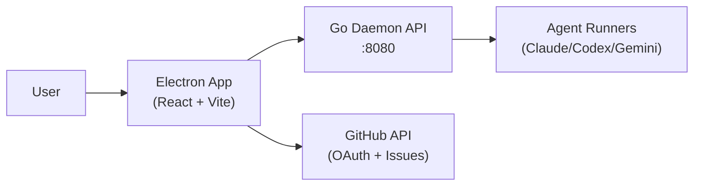

# Auto-Issue Frontend — Implementation Guide

> Electron desktop app + Next.js landing page for autonomous issue resolution
> **Stack:** TypeScript · Electron · React · React Router · Vite · CSS-in-JS

---

## Architecture Overview

The frontend consists of two separate applications:

1. **Desktop App** (Electron + React) — the main Kanban board UI that communicates with the Go backend daemon
2. **Landing Page** (Next.js) — a public marketing/download page



**Key features:**
- Real-time Kanban board showing run statuses (5 columns)
- Live terminal-style log viewer via SSE
- OAuth login with GitHub
- Per-issue provider/model selection (Anthropic, OpenAI, Gemini)
- Approval/rejection UI for human gates
- Analytics dashboard with cost tracking
- Run history with filtering and search

---

## Directory Structure

### Desktop App (Electron)

```
desktop/
├── src/                            # React renderer process
│   ├── App.tsx                     # Root component (routes + auth context)
│   ├── main.tsx                    # Entry point
│   ├── index.css                   # Global styles (CSS variables)
│   ├── components/
│   │   ├── KanbanBoard.tsx         # 5-column Kanban board
│   │   ├── RunCard.tsx             # Card showing run status + metadata
│   │   ├── AgentTerminal.tsx       # Terminal-style log viewer (SSE)
│   │   ├── ApprovePanel.tsx        # Approve/reject UI for human gates
│   │   ├── ProviderBadge.tsx       # Colored provider/model badge
│   │   ├── Sidebar.tsx             # Navigation (BOARD, HISTORY, ANALYTICS, SETTINGS)
│   │   ├── Header.tsx              # Page header
│   │   ├── UserMenu.tsx            # Avatar + sign out
│   │   └── NotificationBell.tsx    # Notification indicator
│   ├── pages/
│   │   ├── LoginPage.tsx           # GitHub OAuth login
│   │   ├── OnboardingPage.tsx      # First-time setup
│   │   ├── DashboardPage.tsx       # Kanban board (main view)
│   │   ├── RunDetailPage.tsx       # Run detail + live terminal
│   │   ├── CreateRunPage.tsx       # Manual run creation form
│   │   ├── HistoryPage.tsx         # Run history with filters
│   │   ├── AnalyticsPage.tsx       # Stats and metrics
│   │   └── SettingsPage.tsx        # Configuration (repos, agents, notifications)
│   ├── lib/
│   │   ├── api.ts                  # IPC-based API client
│   │   ├── sse.ts                  # useSSE / useRunEvents hooks
│   │   └── utils.ts                # Helpers (formatters, validators)
│   └── types/
│       └── index.ts                # TypeScript interfaces
├── electron/                       # Electron main process
│   ├── main.ts                     # Window setup, IPC handlers
│   ├── preload.ts                  # Secure IPC bridge
│   ├── backend-client.ts           # Go backend HTTP client
│   ├── auth.ts                     # GitHub OAuth flow
│   ├── github.ts                   # GitHub API helpers (repos, issues)
│   ├── runner.ts                   # Local test runner
│   ├── store.ts                    # ElectronStore persistence
│   └── shared-types.ts             # IPC type definitions
├── vite.config.ts
├── tsconfig.json
├── tsconfig.electron.json
└── package.json
```

### Landing Page (Next.js)

```
landing/
├── app/
│   ├── page.tsx                    # Hero + features landing page
│   ├── layout.tsx                  # Root layout
│   ├── issue-flow.tsx              # Animated status transition demo
│   └── globals.css                 # Global styles
├── public/                         # Static assets
├── next.config.ts
├── tsconfig.json
└── package.json
```

---

## Key Pages

### `LoginPage.tsx` — OAuth Login (Public)

Minimal login page.

**Design:**
- Centered logo + app name
- "Sign in with GitHub" button
- Monospace font, dark theme

**Flow:**
1. User clicks "Sign in with GitHub"
2. Electron main process opens GitHub OAuth URL in default browser
3. User approves on GitHub
4. OAuth callback exchanges code for user access token
5. Token stored in ElectronStore
6. `auth:success` event triggers navigation to `/dashboard`

### `DashboardPage.tsx` — Kanban Board (Protected)

Main dashboard showing all runs.

**Layout:**
- Left sidebar: Navigation (BOARD, HISTORY, ANALYTICS, SETTINGS)
- Top: Metrics bar (active agents count, daily success rate)
- Main area: 5-column Kanban board
  - `Queued` — issues waiting to run
  - `Running` — agents currently working (shows agent count)
  - `Awaiting Approval` — human needs to decide
  - `Done` — completed successfully
  - `Failed` — error or max iterations reached

**Real-time updates:**
- Polls `/api/v1/issues` every 5 seconds
- "New Run" button navigates to `/create-run`

**Interactions:**
- Click RunCard → navigate to `/run/:id`

### `RunDetailPage.tsx` — Run Detail + Terminal

Full view of a single run execution.

**Layout:**
- Header: issue title, status badge, timestamps
- Left panel:
  - Issue description and metadata (repo, turns, cost, timestamps)
  - File changes summary (+lines / -lines)
  - View PR button (if PR URL available)
  - Approval/rejection panel (if status = awaiting_approval)
- Right panel:
  - AgentTerminal component (SSE log viewer)
  - Status bar: run status, turns, model, elapsed time, cost

### `CreateRunPage.tsx` — Manual Run Creation

Multi-step form for creating a new run.

**Form fields:**
1. Repository selector (paginated search of user's GitHub repos)
2. Issue selector (paginated list of repo's open issues with labels)
3. Provider selector (Anthropic, OpenAI/Codex, Gemini)
4. Model selector (based on selected provider)
5. Summary confirmation before submit

### `HistoryPage.tsx` — Run History

Paginated list of all past runs.

**Features:**
- Sort by date (newest first)
- Filter by: repo, status, provider
- Search by title or issue number
- Runs per page control

### `AnalyticsPage.tsx` — Stats & Metrics

Dashboard with run statistics.

**Features:**
- Date range picker (7d / 30d)
- Summary cards: total runs, success rate, avg time, total cost
- Bar chart: runs per day (stacked success/failed)
- Success rate gauge
- Provider cost breakdown table
- Repository success rates

### `SettingsPage.tsx` — Configuration

Tabbed settings interface.

**Tabs:**
- **Repos** — Toggle which repositories to monitor
- **Agents** — Default provider/model selection, "Test Agent" button
- **Notifications** — Toggle notification types (approval needed, run failed, PR opened)
- **General** — Theme (dark only), polling interval (1-30s), app info

### `OnboardingPage.tsx` — First-Time Setup

Guides new users through initial configuration.

---

## Core Components

### `KanbanBoard.tsx`

Renders the 5-column Kanban.

```typescript
interface KanbanBoardProps {
  runs: Run[]
  onCardClick: (runId: string) => void
}

// Columns: queued, running, awaiting_approval, done, failed
```

**Features:**
- Auto-scroll if column overflows
- Grouped by status (synced with backend state)
- Real-time metrics display

### `RunCard.tsx`

Single run card in Kanban.

**Shows:**
- Issue number + title
- Provider badge (colored by provider)
- Turn count
- Test result badge (if available)
- Cost (if tracked)

### `AgentTerminal.tsx`

Real-time log viewer with SSE streaming.

**Features:**
- Color-coded prefixes: INFO (white), AGENT (green), READ (blue), EDIT (yellow), WRITE (purple), EXEC (amber)
- Auto-scrolls to bottom (pauses if user scrolls up)
- `[HH:MM:SS]` timestamp prefix
- Mac-style traffic light dots at top
- Cursor blink animation during active run
- Status bar: run status, turns, model, elapsed time, cost

### `ApprovePanel.tsx`

Approval/rejection UI for human gates.

```typescript
interface ApprovePanelProps {
  runId: string
  issueNumber: number
}
```

**UI:**
- Feedback textarea for rejection reason
- "Approve" button (green)
- "Reject" button (red)
- Only visible when `status === 'awaiting_approval'`

### `ProviderBadge.tsx`

Colored badge showing AI provider and model.

**Provider colors:**
- Anthropic: Blue
- OpenAI: Green
- Gemini: Yellow

### `Sidebar.tsx`

Navigation menu with items:
- BOARD (dashboard)
- HISTORY (run history)
- ANALYTICS (stats)
- SETTINGS (configuration)

---

## IPC Communication (Electron)

The desktop app uses Electron IPC for secure communication between the renderer (React) and main process.

### IPC Channels

**Invoke (renderer → main):**
```
runs:list, runs:get, runs:create, runs:test, runs:cancel
runs:approve, runs:reject, runs:delete
run:events:get
config:get, config:save
auth:me, auth:login, auth:logout
github:repos, github:issues, github:issue-detail
shell:open-external
```

**Listen (main → renderer):**
```
run:event     — new SSE event from agent
auth:success  — OAuth complete
```

### Backend Client (`electron/backend-client.ts`)

The main process communicates with the Go backend at `http://localhost:8080`:

```typescript
// Runs
GET    /api/v1/issues           → runs:list
GET    /api/v1/issues/:id       → runs:get
POST   /api/v1/issues           → runs:create
DELETE /api/v1/issues/:id       → runs:delete
PUT    /api/v1/issues/:id/move  → runs:approve (to=done), runs:cancel
POST   /api/v1/issues/:id/feedback → runs:reject

// SSE
GET    /api/v1/issues/:id/events → run:event (forwarded to renderer)

// Config
GET    /api/v1/config            → config:get
POST   /api/v1/config/reload     → config:save
```

### GitHub API (`electron/github.ts`)

Direct GitHub API calls using OAuth token:
- List user repositories (paginated)
- List issues per repository (paginated, with labels)
- Get issue details

---

## Types & Interfaces

### Run

```typescript
interface Run {
  id: string
  run_number: number
  issue_number: number
  issue_title: string
  issue_body?: string
  repo: string
  status: 'queued' | 'running' | 'awaiting_approval' | 'pr_opened' | 'done' | 'failed'
  provider: 'anthropic' | 'openai' | 'gemini'
  model: string
  started_at: string
  finished_at?: string
  turns: number
  test_result?: 'passed' | 'failed' | 'skipped'
  pr_url?: string
  files_changed?: number
  lines_added?: number
  lines_removed?: number
  cost_usd?: number
}
```

### SSE Event

```typescript
interface SSEEvent {
  type: 'log' | 'turn' | 'test' | 'status'
  timestamp: string
  prefix: string    // INFO, AGENT, READ, EDIT, WRITE, EXEC, etc.
  content: string
}
```

### User

```typescript
interface User {
  login: string
  avatar_url: string
  name: string | null
}
```

### Settings

```typescript
interface SettingsData {
  default_provider: 'anthropic' | 'openai' | 'gemini'
  default_model: string
  api_keys: { openai: string; anthropic: string; gemini: string }
  notifications: { approval_needed: boolean; run_failed: boolean; pr_opened: boolean }
  polling_interval: number
  monitored_repos: string[]
}
```

### GitHub Types

```typescript
interface GitHubRepo {
  id: number
  full_name: string
  description: string | null
  language: string | null
  open_issues_count: number
  private: boolean
}

interface GitHubIssue {
  number: number
  title: string
  body: string | null
  labels: Array<{ name: string; color: string }>
  created_at: string
}
```

---

## Authentication Flow

### GitHub OAuth (Electron)

1. User clicks "Sign in with GitHub" on login page
2. Electron main process generates GitHub OAuth URL
3. Opens in user's default browser
4. User authorizes on GitHub
5. OAuth callback exchanges code for user access token
6. Token stored securely in ElectronStore
7. `auth:success` event sent to renderer
8. Renderer navigates to `/dashboard`

### Session Management

- Token cached in Electron main process memory
- Persisted in ElectronStore across app restarts
- Used for GitHub API calls and backend authentication

### Protected Routes

```typescript
function ProtectedRoute({ children }) {
  const { user } = useAuth()
  if (!user) return <Navigate to="/" />
  return children
}
```

Routes requiring authentication: `/dashboard`, `/run/:id`, `/create-run`, `/history`, `/analytics`, `/settings`, `/onboarding`

### Logout

```typescript
async function handleLogout() {
  await ipcRenderer.invoke('auth:logout')
  // Clears token from store, navigates to login
}
```

---

## Real-Time Updates

### SSE Streaming

Two mechanisms for real-time agent logs:

1. **Direct EventSource (useSSE hook):**
   - Opens `EventSource('http://localhost:8080/api/v1/issues/:id/events')`
   - Parses JSON events
   - Returns `{ events, connected }`

2. **IPC + SSE (useRunEvents hook):**
   - Loads buffered events from ElectronStore
   - Subscribes to `run:event` IPC channel for live events
   - Main process forwards backend SSE to renderer

### Polling

- Dashboard: polls `/api/v1/issues` every 5 seconds
- Run detail: polls every 3 seconds while running
- Configurable interval in Settings (1-30s range)

---

## Styling & Design

**Dark theme (CSS variables):**
- `--bg`: `#0a0a0a` (near black)
- `--bg2`: darker gray (cards)
- `--fg`: light gray (text)
- `--fg-muted`: medium gray (secondary text)
- `--accent`: `#00e676` (green, primary/success)
- `--amber`: `#ffb300` (running/warning)
- `--blue`: `#42a5f5` (info/PR)
- `--red`: `#ef4444` (error/failed)

**Typography:**
- Monospace font throughout (`var(--font-mono)`)
- Sizes: 9px-28px depending on hierarchy

**Status colors:**
- Queued: Gray
- Running: Amber/Blue
- Awaiting Approval: Amber
- Done: Green
- Failed: Red

**Provider colors:**
- Anthropic: Blue
- OpenAI: Green
- Gemini: Yellow

---

## Development Setup

### Desktop App

```bash
cd desktop

# Install dependencies
npm install

# Run in development mode (Electron + Vite)
npm run dev

# Build for production
npm run build
```

### Landing Page

```bash
cd landing

# Install dependencies
npm install

# Run dev server
npm run dev
# App runs at http://localhost:3000

# Build for production
npm run build
```

The desktop app expects the Go backend to be running on `http://localhost:8080`.

---

## Key Dependencies

### Desktop

```json
{
  "electron": "^33.2.0",
  "react": "^18.3.1",
  "react-dom": "^18.3.1",
  "react-router-dom": "^6.28.0",
  "vite": "^6.0.3",
  "vite-plugin-electron": "...",
  "typescript": "^5.6.3"
}
```

### Landing

```json
{
  "next": "16.1.6",
  "react": "19.2.3",
  "react-dom": "19.2.3"
}
```

---

## Performance Notes

- Kanban polling: 5s interval (configurable, balances freshness vs load)
- SSE streams: only open for focused run (closes on navigation)
- Run list: paginated for large datasets
- Terminal logs: auto-scroll management to prevent DOM bloat
- Analytics: memoized computations with `useMemo`
- Event cleanup on component unmount (intervals, EventSource)
